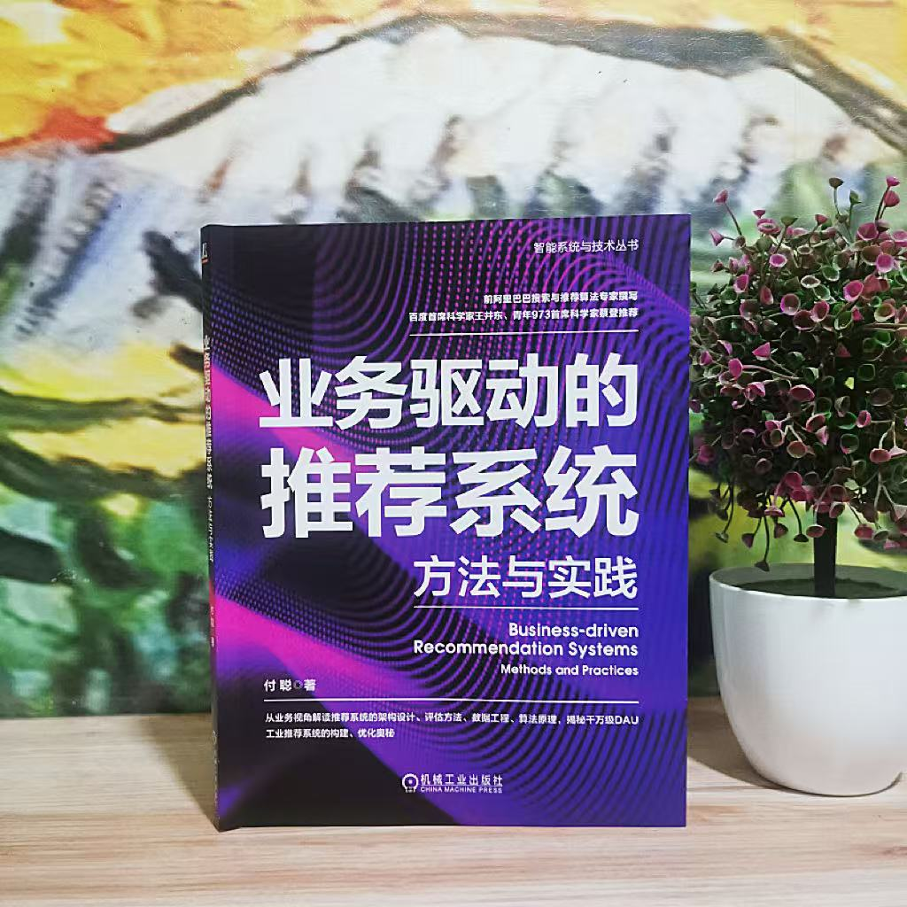

## Hi there, I'm Cong Fu (傅聪) 👋

I’m a **Senior Research Scientist** and **Team Manager** at Shopee (Singapore), where I lead a machine learning engineering team dedicated to optimizing merchandise ranking in large-scale e-commerce systems. I am the creator of NSG and SSG algorithm, which is widely used in industry for large-scale vector database.

### 👯 Research Collaboration

We are actively seeking collaborations on cutting-edge topics in **efficient training and scaling of LLMs**, and **large transformer-style recommender models (LTRM)**. We are especially interested in:

- Scaling laws for LTRM systems
- Agent-style modeling for recommender systems
- Integrations of foundation models into personalized product search and ranking

If you are exploring similar directions or have exciting ideas, feel free to reach out!

---

### 🌱 Research Interests

My research focuses on building **Scalable and Practical AI Systems** to expand the boundaries of intelligent products in real-world applications. Our interests span multiple dimensions:

#### 🧠 1. Foundation Models and Training Efficiency

Foundation models define the upper bound of AI capabilities. To accelerate deployment and productization, we work on:

- **Efficient pre/post-training strategies**
- **Life-long learning & continual adaptation**
- **Model compression & distillation**
- **Beyond-transformer paradigms**
- **General-purpose ML efficiency**

#### ⚙️ 2. Tools that Empower AI Agents

Modern AI agents depend heavily on effective interaction with key tools. We aim to enhance:

- **Search engines, recommender systems, and vector databases**
- **Retrieval-augmented generation (RAG)**
- **Tool-use optimization for agent systems**

#### 🤖 3. Large-Scale AI Agent Systems

Inspired by prior advances in agent collaboration and reinforcement learning, we’re exploring:

- **Personalization-aware learning for agents**
- **Scalable multi-agent systems**
- **Collaborative decision-making and planning**

---

### 💡 Mission

Our long-term goal is to bridge **state-of-the-art research** with **real-world AI products**, improving both **efficiency** and **effectiveness** at scale. We believe the future of AI lies in the synergy between powerful foundation models, intelligent tools, and adaptive agent systems.

---

### 🧭 Background & Experience

- 🎓 **Academic Training**  
  I received both my Ph.D. and Bachelor's degrees from **Zhejiang University (ZJU)**, where I was fortunate to be mentored by **Professor Xiaofei He** (*National Distinguished Young Scholar*, former Dean of Didi Research Institute) and **Professor Deng Cai** (*National Excellent Young Scholar*).  
  I also spent time as a **Visiting Scholar at the University of Southern California (USC)**, collaborating with **Professor Xiang Ren** on research in machine learning and knowledge representation.

- 💼 **Industry Experience**  
  Previously, I worked as an **Expert Machine Learning Engineer at Alibaba Group**, where I contributed to large-scale AI systems and recommendation technologies powering Alibaba's core platforms.

---

### 💡 Publications & Code

📚 **Academic Profile**  
Check out my [Google Scholar](https://scholar.google.com/citations?user=Gvp9ErEAAAAJ&hl=en&oi=ao) for a full list of publications.

🧠 **Open-Source Contributions**

**Large-Scale Vector Databases**

- [NSG](https://github.com/ZJULearning/nsg): Efficient vector retrieval in Euclidean space.
- [SSG](https://github.com/ZJULearning/SSG): Optimized structure for scalable search in Euclidean space.
- [Efanna](https://github.com/ZJULearning/efanna): Fast approximate nearest neighbor search in Euclidean space.
- [PSP](https://github.com/ZJU-DAILY/PSP): Indexing for inner product similarity search.
- [MAG](https://github.com/ZJU-DAILY/MAG): Unified indexing for both Euclidean and inner product similarity.

**Recommender Systems**

- [ResFlow](https://github.com/BrunoTruthAlliance/ResFlow): Low-cost joint learning framework for multi-behavior recommendation.

📘 **Books**

- *Business Driven Recommender Systems: Methodology and Practice* 《业务驱动的推荐系统：方法与实践》

---

### 📫 Get in Touch

- 📧 Email: fc731097343 [at] gmail.com
- 💼 [LinkedIn](https://www.linkedin.com/in/cong-fu-23b45884?utm_source=share&utm_campaign=share_via&utm_content=profile&utm_medium=ios_app)
- 💬 [X] (https://x.com/CongFuNSG)
- 💬 [Zhihu (知乎)](https://www.zhihu.com/people/FU-CONG-BEN)

